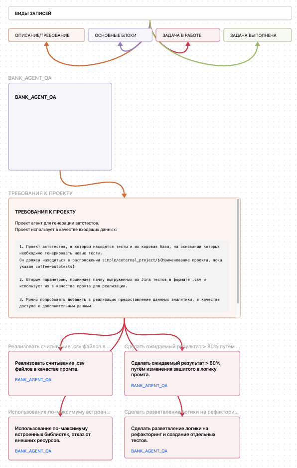

Проект агент для генерации автотестов.

Проект использует в качестве входящих данных:

```
1. Проект автотестов, в котором находятся тесты и их кодовая база, на основании которых необходимо генерировать новые тесты.
Он должен находиться в расположении bank-agent-qa/external_project/${Наименование проекта, пока указан coffee-autotests}

2. Вторым параметром, принимает пачку выгруженных из Jira тестов в формате .csv и использует их в качестве промта для реализации.

3. Можно попробовать добавить в реализацию предоставление даннных аналитики, в качестве доступа к дополнительным данным.
```


